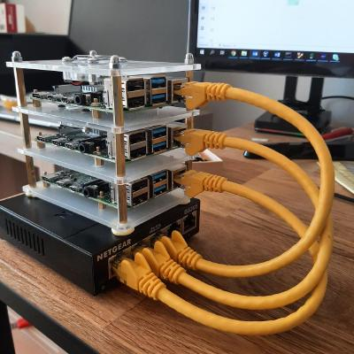

### Hi there 👋

*Welcome on my GitHub profile, find below information concerning organization of my repositories*

* [Organization deployment process](docs/deployment-process.md)
* [Organization deployments strategy](docs/deployment-strategy.md)

Many of the projects maintained here are showcased at https://sylvan.ovh.

They are hosted on a kubernetes cluster of 3 nodes made of raspberry pi.

*Say hello to raspberry pi kubernetes cluster*

