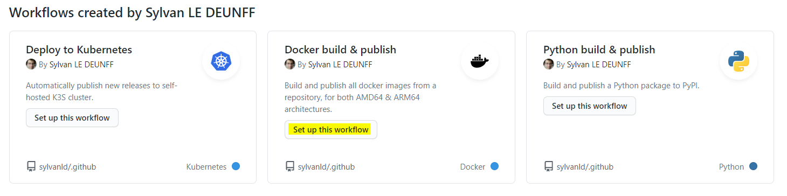

# Deployment Process

_This document explains how to implement [organization's deployment strategy](./deployment-strategy.md)._

## Configure images publish on release

1. Open GitHub actions tab


2. Select workflow **Docker build & publish**



3. Customize settings for the needs of your project

[optional] Change docker registry or organization used to host your images

```yaml
env:
  DOCKER_REGISTRY_URL: docker.io
  DOCKER_ORG_NAME: sylvanld
```

Specify images to be built in your repository

```yaml
strategy:
  matrix:
    include:
      # build an image name frontend from folder frontend/
      - image-name: frontend
        build-context: frontend/
      # build an image name backend from folder backend/
      - image-name: backend
        build-context: backend/
```

> :boom: With the previous example when creating release `X.Y.Z`, two images will be built and push to dockerhub. (`sylvanld/frontend:X.Y.Z` and `sylvanld/backend:X.Y.Z`)

## Configure kubernetes deployment on release

## Describe your deployment using K8S yaml file

Create a file describing your kubernetes deployment in the project repository.

_Example of a kubernetes config file to deploy a webapp_

```yaml
---
apiVersion: apps/v1
kind: Deployment
metadata:
  name: test2-frontend
  labels:
    app: test2-frontend
spec:
  replicas: 1
  selector:
    matchLabels:
      app: test2-frontend
  template:
    metadata:
      labels:
        app: test2-frontend
    spec:
      containers:
        - name: test2-frontend
          image: sylvanld/test2-frontend:0.0.4
          ports:
            - containerPort: 80

---
apiVersion: v1
kind: Service
metadata:
  name: test2-frontend-service
spec:
  selector:
    app: test2-frontend
  ports:
    - protocol: TCP
      port: 80

---
apiVersion: networking.k8s.io/v1beta1
kind: Ingress
metadata:
  name: test2-frontend-ingress
  annotations:
    kubernetes.io/ingress.class: "traefik"
spec:
  # URL rule so that our web service will be available at http://test2.sylvan.ovh/
  rules:
    - host: test2.sylvan.ovh
      http:
        paths:
          - path: /
            backend:
              serviceName: test2-frontend-service
              servicePort: 80
```
