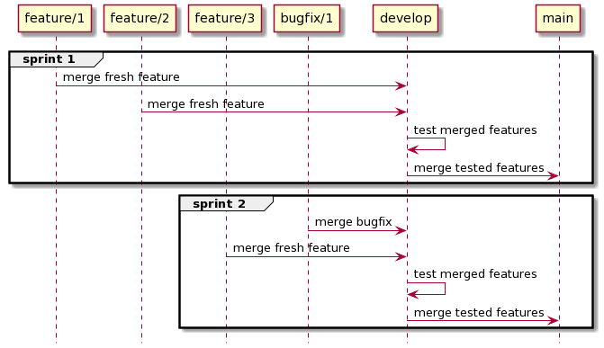
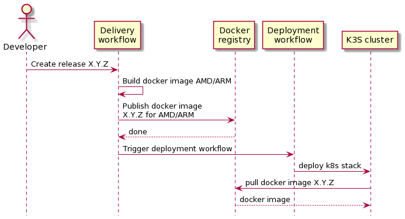

# Deployment Strategy

_In this document, I describe deployment strategy used for this whole GitHub organization and the reasons that motivated theses choices. For a concrete example of how to implement this strategy, please read the [deployment process](./deployment-process.md).

## Foreword

_To be efficient the deployment process_

- must be simple enough so that deploying a new application take at most 10 mn.
- must have centralized configuration so that it can be re-deployed from scratch automatically.
- must rely on continuous deployment so that running applications are always up to date.

## Releases tagging

We are going to follow semantic versionning.

## Branches naming convention

| Branch      | Usage                                                                                     |
| ----------- | ----------------------------------------------------------------------------------------- |
| **main**    | reflect latest stable release of an application. Fully tested and suppose to always work. |
| **develop** | intermediate branch used to resolve conflicts while merging features and bugfix.          |
| feature/\*  | kind of branch used when adding new features. (merged on develop)                         |
| bugfix/\*   | kind of branch used when working on bug fixes. (merged on develop)                        |

_Example of branching flow for 2 sprints_

## Continuous delivery/deployment on release

